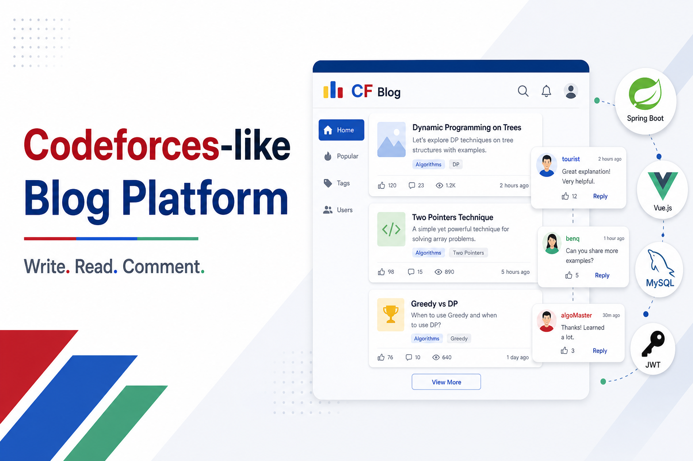
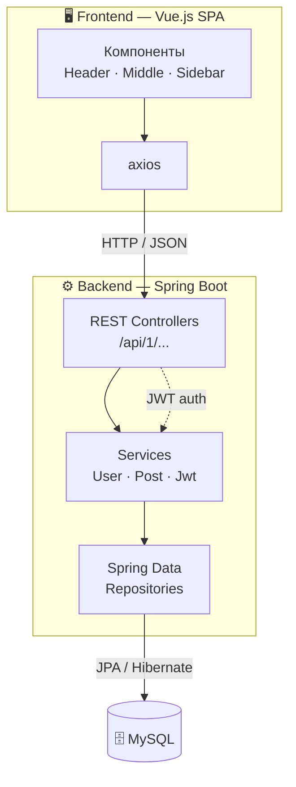

<div align="center">



# 📝 Codeforces-like Blog Platform

**Пиши. Читай. Комментируй.**

Мини-социальная платформа для публикаций, вдохновлённая интерфейсом [Codeforces](https://codeforces.com).
Регистрируйся, публикуй посты и обсуждай записи других участников.

<br/>

<!-- Технологии -->


<!-- Мета-бейджи репозитория -->
<br/>


</div>

---

## ✨ Возможности

- 🔐 **Регистрация и вход** — аутентификация на основе JWT-токенов, пароли хранятся в виде посоленного SHA-хеша.
- 🗞️ **Лента постов** — на главной (Index) отображаются все публикации, отсортированные по дате.
- ✍️ **Создание постов** — авторизованные пользователи могут писать собственные записи.
- 💬 **Комментарии** — отдельная страница поста показывает запись целиком вместе со всеми комментариями и их авторами; можно оставлять новые. На главной у каждого поста выводится корректное число комментариев.
- 👥 **Список пользователей** — страница со всеми зарегистрированными участниками системы.
- ✅ **Серверная валидация** — проверка форм регистрации, входа, постов и комментариев с внятными сообщениями об ошибках.

---

## 🛠 Технологический стек

<table>
  <tr>
    <td align="center" width="120">
      <br/>Java
    </td>
    <td align="center" width="120">
      <br/>Spring Boot
    </td>
    <td align="center" width="120">
      <br/>JPA / Hibernate
    </td>
    <td align="center" width="120">
      <br/>MySQL
    </td>
    <td align="center" width="120">
      <br/>Vue.js 2
    </td>
    <td align="center" width="120">
      <br/>axios
    </td>
  </tr>
</table>

**Backend**
- Java · Spring Boot (`@RestController`)
- Spring Data JPA / Hibernate
- MySQL
- JWT (`com.auth0:java-jwt`)
- Bean Validation (`javax.validation`)

**Frontend**
- Vue.js 2 · axios
- Кастомный CSS в духе Codeforces (`normalize.css`, `style.css`, `article.css`, `form.css`, `datatable.css`)

---

## 🧭 Архитектура

Клиент-серверное приложение: SPA на Vue.js общается с REST-бэкендом на Spring Boot через JSON, данные хранятся в MySQL.



<details>
<summary>📂 <b>Структура проекта</b> (нажмите, чтобы развернуть)</summary>

<br/>

```
web-application/
├── backend/                     # Spring Boot REST API
│   └── src/main/
│       ├── java/ru/itmo/wp/
│       │   ├── controller/      # REST-контроллеры (User, Post, Jwt) + обработка исключений
│       │   ├── domain/          # JPA-сущности: User, Post, Comment
│       │   ├── form/            # DTO-формы и валидаторы
│       │   ├── repository/      # Spring Data репозитории
│       │   ├── service/         # Бизнес-логика (User, Post, Jwt)
│       │   └── exception/       # Кастомные исключения
│       └── resources/
│           └── application.properties
│
└── frontend/                    # Vue.js SPA
    ├── public/
    │   ├── index.html
    │   └── css/                 # Стили в стиле Codeforces
    └── src/
        ├── App.vue              # Корневой компонент, состояние и event-bus
        ├── main.js
        └── components/
            ├── Header.vue       # Шапка: навигация, вход/выход
            ├── Middle.vue       # Роутинг между страницами
            ├── Footer.vue
            ├── main/            # Index, Register, Enter, Users, Post, Comment, WritePost
            └── sidebar/         # Sidebar, SidebarPost
```

</details>

<details>
<summary>🗃️ <b>Модель данных</b></summary>

<br/>

| Сущность  | Описание                                                          |
|-----------|-------------------------------------------------------------------|
| `User`    | Пользователь: `login`, `name`, флаг `admin`, дата создания, посты  |
| `Post`    | Пост: `title`, `text`, автор (`User`), дата создания, комментарии  |
| `Comment` | Комментарий: `text`, автор (`User`), связанный пост (`Post`)       |

</details>

---

## 📡 REST API

Базовый префикс — `/api/1`.

<details open>
<summary><b>Список эндпоинтов</b></summary>

<br/>

| Метод  | Endpoint             | Описание                                     |
|--------|----------------------|----------------------------------------------|
| `GET`  | `/api/1/users`       | Получить список всех пользователей           |
| `POST` | `/api/1/users`       | Регистрация нового пользователя             |
| `GET`  | `/api/1/users/auth`  | Получить пользователя по JWT (`?jwt=...`)    |
| `POST` | `/api/1/jwt`         | Вход: выдача JWT по логину и паролю         |
| `GET`  | `/api/1/posts`       | Получить все посты                           |
| `POST` | `/api/1/posts`       | Создать пост (требуется JWT)                 |
| `POST` | `/api/1/comments`    | Добавить комментарий к посту (требуется JWT) |

</details>

---

## 🚀 Запуск проекта

### Требования
- ☕ **JDK 8+** и **Maven**
- 🟢 **Node.js** и **npm**
- 🗄️ Запущенный сервер **MySQL**

<details>
<summary><b>1️⃣ Настройка базы данных</b></summary>

<br/>

Создайте базу данных в MySQL и укажите параметры подключения. В `backend/src/main/resources/application.properties` значения подставляются из свойств сборки:

```properties
spring.datasource.url=@database.url@
spring.datasource.username=@database.user@
spring.datasource.password=@database.password@
server.port=8090
```

Задайте их через `application.properties`, Maven-профиль или переменные окружения под своё окружение.

</details>

<details>
<summary><b>2️⃣ Backend</b></summary>

<br/>

```bash
cd backend
mvn spring-boot:run
```

Сервер поднимется на **http://localhost:8090**.

</details>

<details>
<summary><b>3️⃣ Frontend</b></summary>

<br/>

```bash
cd frontend
npm install
npm run serve
```

SPA будет доступно на dev-сервере Vue (обычно **http://localhost:8080**) и обращается к бэкенду по `/api/1/...`.

</details>

---

## ⚙️ Как это работает

1. При запуске `App.vue` подгружает списки постов и пользователей, а также восстанавливает сессию из JWT, сохранённого в `localStorage`.
2. Взаимодействие между компонентами построено на **event-bus** через `this.$root.$emit / $on` (регистрация, вход, выход, создание поста и комментария).
3. Бэкенд валидирует входящие данные, работает с БД через Spring Data JPA и возвращает JSON; ошибки валидации обрабатываются глобальным `RestControllerExceptionHandler`.

---

<div align="center">

Учебный проект по веб-программированию · **ITMO** · пакет `ru.itmo.wp`

Сделано с ❤️ и ☕

</div>
